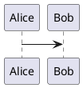

# Rspress Markdown Extension

Use this skill when working with the project's Rspress-specific Markdown extensions.

The primary targets are:

* `rspress-plugin-rst-directives`
* `rspress-plugin-plantuml`

This skill does not define general Markdown, MDX, Rspress, remark, or rehype practices. Follow the repository's general Rspress and development guidance for those concerns.

## Inspect the actual plugin implementation first

Before changing behavior, locate and inspect the relevant plugin package.

Determine:

* package name
* installed or workspace version
* plugin entry point
* configuration options
* parser or transformer implementation
* tests
* fixtures or example Rspress site
* README or syntax documentation

Do not infer supported syntax from reStructuredText or PlantUML documentation alone.

The implementation and tests of the plugin are the source of truth for what the project currently supports.

# rspress-plugin-rst-directives

`rspress-plugin-rst-directives` provides selected reStructuredText-style directives inside Rspress Markdown.

It is not a general reStructuredText parser.

Do not assume compatibility with arbitrary reStructuredText directives or docutils behavior.

## Compatibility model

Treat supported syntax as an explicitly implemented subset.

Prefer descriptions such as:

```text
reStructuredText-style directive
```

or:

```text
a subset of the reStructuredText directive syntax
```

unless tests demonstrate compatibility with the corresponding reStructuredText behavior.

Do not claim complete reStructuredText compatibility.

## Directive recognition

Only transform directive names explicitly supported by the plugin.

A directive generally resembles:

```text
.. directive-name:: argument
   :option-name: value

   body
```

Do not interpret arbitrary lines beginning with `..` as directives.

Unknown directives should follow the plugin's existing fallback behavior.

Do not silently add generic handling for unsupported directive names.

## Preserve literal examples

Directive-like text inside code blocks must remain literal.

For example:

````markdown
```text
.. list-table:: Example
   :header-rows: 1
```
````

must not be processed as an actual directive.

This is important because documentation for the plugin itself will frequently contain directive examples.

Always include regression tests when changing directive recognition.

## Shared directive parsing

When adding a directive, reuse existing shared directive parsing infrastructure where appropriate.

Do not create a second independent parser for:

* directive name
* primary argument
* options
* body
* indentation

unless the syntax genuinely requires different parsing semantics.

Keep generic directive recognition separate from directive-specific conversion.

A preferred structure is conceptually:

```text
directive source
    |
    v
shared directive parser
    |
    v
parsed directive
    |
    +--> list-table transformer
    +--> figure transformer
    +--> other directive transformer
```

## Options

Directive option names and values must be handled explicitly.

Do not pass arbitrary options directly to generated HTML or React components.

For every supported option:

* define its expected value type
* define whether it is optional
* validate malformed values
* define default behavior
* add tests

Unknown options should follow the plugin's established behavior.

Do not silently reinterpret unknown options.

## Indentation

Directive boundaries depend on indentation.

When changing the parser, test at minimum:

* directive with no body
* directive with options
* directive with body
* multiple directives
* directive followed immediately by normal Markdown
* directive at end of file
* nested Markdown in the body
* incorrect indentation

Do not solve indentation bugs by globally trimming input lines.

Preserve relative indentation inside directive bodies when nested Markdown depends on it.

## `list-table`

The `list-table` directive represents a table using nested list syntax.

Example:

```text
.. list-table:: Example
   :header-rows: 1

   * - Name
     - Description
   * - Alpha
     - First item
```

Treat the directive parser and table parser as separate responsibilities.

Conceptually:

```text
directive
   |
   v
options + body
   |
   v
list-table body parser
   |
   v
rows / cells
   |
   v
Rspress-compatible table representation
```

Do not make rendering code responsible for discovering row and cell boundaries.

### Row structure

Each top-level list item represents one row.

Nested list items represent cells according to the plugin's defined grammar.

Validate malformed structures deliberately.

Test:

* one row
* multiple rows
* one column
* multiple columns
* uneven row lengths
* empty cells
* Markdown inside cells
* multiline cell contents

Do not silently discard malformed cells.

### `header-rows`

If `:header-rows:` is supported, treat it as a non-negative integer.

Validate:

* `0`
* `1`
* values greater than `1`
* non-numeric values
* negative values
* values greater than the available number of rows

Do not parse invalid values into accidental JavaScript values such as `NaN` and continue silently.

Follow existing plugin behavior for invalid values and preserve it with tests.

### Cell content

Cell content may contain Markdown.

Do not flatten every cell into plain text if the current plugin supports structured Markdown content.

Preserve:

* emphasis
* links
* inline code
* paragraphs
* other supported nested Markdown

Do not introduce nested-table support unless explicitly required.

## `figure`

The `figure` directive represents an image together with figure-specific metadata or content.

Example:

```text
.. figure:: ./image.png
   :alt: Example image
   :width: 400

   Example caption.
```

Treat a figure as more than an image.

Potential concepts include:

* image source
* alt text
* caption
* body or legend
* width
* height
* alignment
* CSS class
* target link

Only implement options actually defined by this plugin.

Do not automatically copy the complete option set from docutils or Sphinx.

### Image path handling

Resolve image paths according to the plugin's established Rspress behavior.

Do not assume:

* filesystem-relative paths
* site-root-relative paths
* Markdown-file-relative paths

without checking the implementation and tests.

Changes to path resolution require integration tests through an actual Rspress build.

### Caption and body

If figure body text is parsed as Markdown, preserve that behavior.

Do not flatten captions into arbitrary HTML strings.

Keep image attributes and figure content separate in the internal representation where practical.

## Adding another rst-style directive

Before implementing another directive:

1. identify the syntax subset to support
2. inspect how similar existing directives are implemented
3. define supported options
4. define body semantics
5. define malformed-input behavior
6. add parser tests
7. add integration coverage
8. document differences from reStructuredText if relevant

Do not expand the plugin into a general reStructuredText implementation as a side effect of adding one directive.

# rspress-plugin-plantuml

`rspress-plugin-plantuml` handles PlantUML code embedded in Rspress documentation.

Treat PlantUML source as diagram source code, not ordinary Markdown content.

## Recognize only the configured PlantUML syntax

Inspect the plugin to determine how PlantUML blocks are identified.

A common form may be:

````markdown

````

but do not assume this exact syntax if the implementation supports different fence names or conventions.

Only transform code blocks explicitly recognized as PlantUML input.

Other code blocks must remain unchanged.

## Preserve PlantUML source exactly unless required

PlantUML syntax is whitespace-sensitive in some constructs and may contain arbitrary characters.

Do not:

* trim lines unnecessarily
* normalize indentation without need
* escape PlantUML syntax as Markdown
* rewrite PlantUML source using generic Markdown transformations

Pass the diagram source to the renderer with minimal transformation.

## Rendering lifecycle

Determine whether the plugin renders PlantUML:

* at Rspress build time
* through JavaScript
* in the browser
* through an external PlantUML process
* through a server
* through another renderer

before making architectural changes.

Do not assume a Java or Graphviz-based PlantUML runtime is available.

Do not assume browser-side rendering is available.

The plugin's existing rendering architecture is the source of truth.

## Generated SVG

If PlantUML is rendered to SVG, preserve SVG as vector output when practical.

Do not rasterize SVG merely to simplify integration.

When handling generated SVG:

* preserve viewBox information
* avoid fixed dimensions unless intentionally required
* avoid stripping text or style information without reason
* ensure generated markup can be safely embedded in the Rspress output

Changes that affect SVG sizing must be tested using diagrams containing long labels.

## Text overflow and sizing

PlantUML SVG output can expose sizing issues where text extends beyond an incorrectly constrained container or viewport.

When fixing overflow, investigate separately:

1. the SVG generated by the PlantUML renderer
2. SVG `width`, `height`, and `viewBox`
3. the Rspress container CSS
4. any plugin-side SVG rewriting
5. responsive layout behavior

Do not assume the PlantUML renderer itself is the cause.

Do not solve overflow by arbitrarily clipping the SVG.

Prefer preserving the renderer's intrinsic geometry and making the surrounding layout responsive.

## Responsive rendering

Generated diagrams should remain usable within documentation content.

When appropriate, prefer behavior equivalent to:

```css
max-width: 100%;
height: auto;
```

through the project's existing styling mechanism.

Do not blindly apply these exact declarations if the plugin has another established layout model.

Verify:

* wide diagrams
* narrow diagrams
* long text labels
* mobile-width content
* dark and light themes if relevant

## Browser-side PlantUML rendering

If the plugin performs rendering in the browser:

* do not assume rendering completes synchronously
* account for component lifecycle
* avoid rendering the same diagram repeatedly without need
* ensure navigation between Rspress pages does not leave stale diagrams
* avoid global DOM scans when a component-scoped approach exists

If rendering is asynchronous, failures should produce actionable diagnostics rather than leaving an empty diagram silently.

## Build-time PlantUML rendering

If rendering occurs at build time:

* deterministic output is preferred
* failures should identify the source document
* renderer errors should include enough PlantUML context to diagnose the failure
* temporary files should be cleaned up
* generated files should not be committed unless that is the project's explicit design

Do not start an uncontrolled long-running PlantUML service as part of the build.

## PlantUML delimiters

If fenced Markdown already identifies PlantUML source, determine whether the plugin requires users to include:

```text
@startuml
@enduml
```

or adds them automatically.

Do not change this behavior casually.

Adding or stripping PlantUML delimiters affects compatibility with existing documents and requires regression tests.

## Error handling

Invalid PlantUML should not result in an unrelated Rspress or React exception.

Surface renderer failures with context such as:

* source document
* diagram block location when available
* renderer error message

Do not hide PlantUML syntax errors behind a generic message such as:

```text
Failed to build site
```

when more specific information is available.

## Multiple diagrams

Always test documents containing multiple PlantUML blocks.

Ensure:

* each diagram is rendered independently
* output IDs do not collide
* one failed or unusual diagram does not corrupt following diagrams
* generated DOM or SVG identifiers do not conflict where relevant

## PlantUML inside literal examples

A PlantUML fence shown as an example inside a larger code block must remain literal.

For example, documentation explaining how to write:

````text
```plantuml
Alice -> Bob
```
````

must not accidentally render that nested example as a diagram.

Add regression coverage when changing fence detection.

# Changes affecting both plugins

`rspress-plugin-rst-directives` and `rspress-plugin-plantuml` may coexist in the same document.

Do not assume only one custom Markdown extension runs.

Test combinations where relevant, especially:

* PlantUML before a directive
* PlantUML after a directive
* PlantUML inside directive body when supported
* directive syntax shown inside a PlantUML or code example
* multiple extensions in one document

Plugin ordering may be significant.

Do not reorder the plugins without checking whether either transformation depends on the other's output.

# Testing

Prefer focused tests for each plugin's own grammar or rendering behavior.

For `rspress-plugin-rst-directives`, prioritize:

* directive recognition
* indentation
* options
* body parsing
* malformed syntax
* `list-table`
* `header-rows`
* `figure`

For `rspress-plugin-plantuml`, prioritize:

* PlantUML fence recognition
* source preservation
* multiple diagrams
* renderer errors
* SVG output
* long labels and sizing
* literal code examples

After focused tests pass, run the repository's Rspress integration or production build.

## Regression-first bug fixes

For a parser or renderer bug:

1. reproduce the problem with the smallest input
2. add a failing regression test
3. confirm the expected failure
4. implement the smallest fix
5. rerun the focused test
6. run the existing plugin tests
7. run the Rspress production build when applicable

Keep parser and renderer fixes narrowly scoped.

# Documentation

When changing either plugin, update its documentation if user-visible syntax or behavior changes.

For `rspress-plugin-rst-directives`, document only the supported subset.

For `rspress-plugin-plantuml`, document:

* recognized code-fence syntax
* delimiter requirements
* rendering behavior
* relevant configuration
* known renderer limitations

Do not document upstream reStructuredText or PlantUML capabilities that the plugin does not expose.

# Final verification

Before considering work complete, verify as applicable:

* existing documents still compile
* literal examples remain literal
* multiple extensions can coexist
* focused plugin tests pass
* production Rspress build passes
* no unnecessary development server or renderer process remains running

Do not claim compatibility or successful verification beyond what was actually tested.
